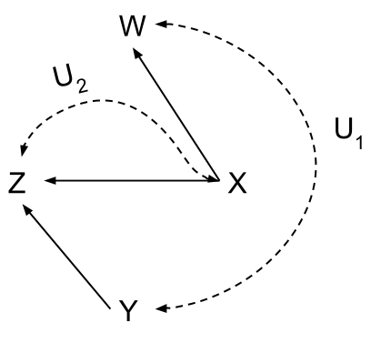
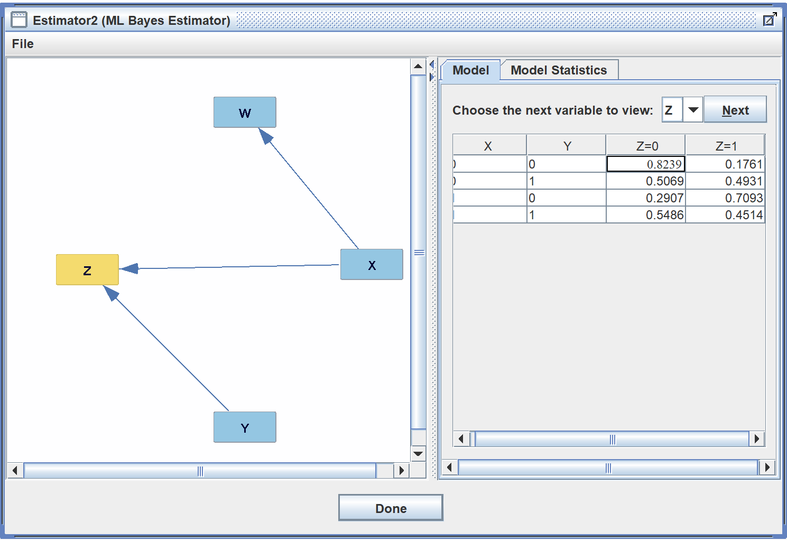
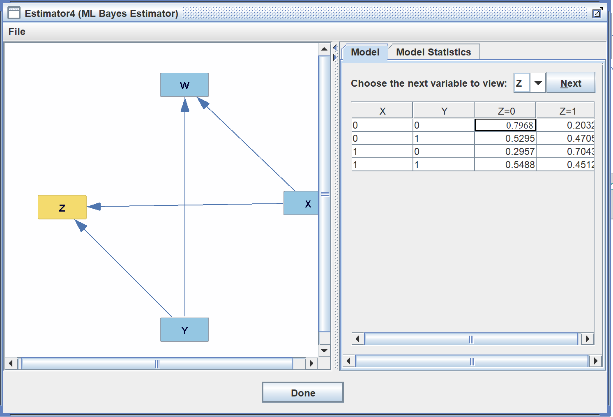

# Donovan Moini, Lucille Njoo, Serena Zafiris

# Problem 1

This comic is funnyTM&copy; because it appears that the robots seem to be in the first level of the causal hierarchy, i.e the associational level. The associational level answers questions such as "is x associated with y?". Since humanity has had pre-modern weaponry for a majority of their time on Earth, most of the wars won were with that type of weaponry because there have been more wars fought overall with that type of weaponry as opposed to more modern and deadly weapons. The robots would then associate winning wars with pre-modern weaponry and thus make their decisions based off of that.

# Problem 2

1. P(T=1 | E=0, W=1)
2. P(T=1 | do(R=1), E=0)
3. P(T=1 | do(E=0)) - P(T=1 | do(E=1))
4. P(T=1 | R=0) - P(T=1 | R=1)

# Problem 3

P(H | do(E=1))  
**Step 1:**  
Q = {H}, e = {do(E=1)}, y = {V, S}

**Step 2:**  
Roadmap:  
PE=1(H=1) = $\sum_{V, S}^{}$ PE=1(H=1, V=v, S=s)  
Using the manipulation rule  
= $\sum_{V, S}^{}$P(S=s)P(V=v | S=s)P(H=1 | E=1, V=v)

**Step 3:**  
No need to normalize due to lack of ambiguity  

**Step 4:**  
Compute for all combinations of V and S:  
= P(S=0)P(V=0 | S=0)P(H=1 | E=1, V=0)  + P(S=0)P(V=1 | S=0)P(H=1 | E=1, V=1)  + P(S=1)P(V=0 | S=1)P(H=1 | E=1, V=0)  + P(S=1)P(V=1 | S=1)P(H=1 | E=1, V=1)  
= (0.3)(0.8)(0.1) + (0.3)(0.2)(0.6) + (0.7)(0.3)(0.1) + (0.7)(0.7)(0.6)  
= 0.024 + 0.036 + 0.021 + 0.294  
= **0.375**

# Problem 4

## Part 1

1. _Test Anxiety Survey Graph_ 
2. _Sleep Interruption Study Graph_ 
3. _Study Group Study Graph_ 

In the Study Group study graph, the line between W (whether or not a student got 8+ hours of sleep) and X (whether or not the student exercised the day before the exam) is undirected because in Tetrad, the graphs model purely associational-layer independence relationships regardless of whether the variables are associationally or experimentally related. This causes _observational equivalence_ issues to arise when either direction of an arrow would result in the same independence relationships. The arrow between W and X would either produce a chain (W -> X -> Z) or a fork (W <- X -> Z), both of which follow the same d-separation rules.

## Part 2

Our final model is as follows:  
  
The connection from W -> Y is through an unobserved confounder due the fact that they are initially linked in the survey graph, but they become independent when the do(Y) operator is applied in the study graph. The connection from Y -> Z does not have an unobserved confounder because if you look at the CPT's below, they are similar enough that we can assume that there is no unobserved confounder.
_Study CSV Graph_
_Survey CSV Graph_
The connection from X -> Z has an unobserved confounder because we do not have enough evidence to rule it out. The connection from X -> W can be made based on our background knowledge that exercise leads to better sleep.

# Problem 5

1. **P(Z|do(X))**: 
   (1) Yes, identifiable; back-door admissible with set Z = {A}. This leaves all directed paths from X to Z (X-Y-Z and X-B-Z) unperturbed, and both spurious paths from X-A-U-B-Z and from X-A-U-B-W-C-Z are blocked when we condition on A since A is a chain.  

   (2) Adjustment formula: 
   P(Z=z|do(X=x)) = $\sum_{a∈A}^{}$ P(Z=z|X=x,A=a) P(A=a)

2. **P(B|do(A))**: 
   (1) Yes, identifiable; front-door admissible with set of intermediate variables Z = {X}. While we cannot find a back-door admissible set for this exact query, front-door admissibility applies here because P(X|do(A)) is back-door admissible (the paths A-U-B-X, A-U-B-Z-Y-X, and A-U-B-W-C-Z-Y-X can all be blocked with a back-door admissible set Z = { } because of the sinks at B and Z), and P(B|do(X)) is back-door admissible with a set Z = {A} (blocking the spurious path from X-A-U-B). Thus, we can use X as an intermediate variable for the front-door criterion.  

   (2) Adjustment formula: 
   P(B=b|do(A=a)) = 
   $\sum_{x∈X}^{}$ P(X=x|do(A=a)) \* P(B=b|do(X=x)) =  
   $\sum_{x∈X}^{}$ P(X=x|A=a) $\sum_{a∈A}^{}$ P(B=b|X=x,A=a) P(A=a)

3. **P(Z|do(C))**:  
   (1) Yes, identifiable; back-door admissible with set Z = {B, Y}. Conditioning on B will block the spurious path from C-W-B-Z, and conditioning on Y will block the paths C-W-B-X-Y-Z and C-W-B-U-A-X-Y-Z.  

   (2) Adjustment formula:  
   P(Z=z|do(C=c)) = $\sum_{b∈B,y∈Y}^{}$ P(Z=z|C=c,B=b,Y=y) P(B=b,Y=y)

4. **P(Z|do(A))**:  
   (1) No, not identifiable because there is no way to block all spurious paths without interfering with directed paths from A to Z. The path A-U-B-Z is a spurious path, but we cannot condition on U because it is an unobserved confounder, and we also cannot condition on B because that would block the directed path A-X-B-Z, which would incorrectly intercept part of the causal effect of A on Z.

# Problem 6

## 1. Model Validator

We can compute P(Y=1|do(X=x))∈x using the observational data by performing back-door adjustment and using the back-door admissible set Z={W} because conditioning on W blocks all spurious paths. This means that P(Y=1|do(X=x))∈x = $\sum_{w∈W}^{}$ P(Y=1|X=x,W=w)P(W=w)∈x. Using the Bayesian Network created from the observational data, we found that P(Y=1|do(X=0)) = 0.480 and P(Y=1|do(X=1)) = 0.432. Then, we computed P(Y=1|do(X=x))∈x using the experimental model (dropping the do operator because X has already been randomized as a treatment in the experimental data). The values we found from the experimental model were P(Y=1 | X=0) = 0.479 and P(Y=1 | X=1) = 0.429. Since the probabilities between the observational and experimental models are very close (0.480 vs 0.479; 0.432 vs 0.429), these results validate the observational model.

## 2. Treatment Suggestion

(1) We computed the query P(Y=1|W=0,M=0,X=x)∈ x using the experimental model. (We can drop the do operator in the equation because we are computing on the experimental model, which means that X was already a treatment randomized and carried out in the experimental data.) This results in the values P(Y=1|W=0,M=0,X=0) = 0.7137 and P(Y=1|W=0,M=0,X=1) = 0.6618. Since 0.7137 > 0.6618, the optimal treatment is X=0. 

(2) Using our previous knowledge of X=0 being the best treatment, we computed the query P(X=0|W=0, M=0) using the observational model. This results in P(X=0|W=0, M=0) = 0.313. This means ~31% of the time, doctors "in the wild"TM / "in nature"TM are prescribing the optimal treatment for patients of this type (i.e., those for which W=0,M=0). Thus, doctors have much room for improvement in prescribing the optimal treatment.
