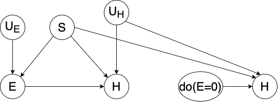

# Our Beautiful Report

## Donovan Moini, Lucille Njoo, Serena Zafiris

**Note:** We had issues with displaying math equations/latex in Markdown on GitHub as well as when converting to a PDF, so summations are in raw `$\sum_{X}^{}$` form in the `report.pdf`. They should, however, render correctly when the Markdown file is being previewed in Visual Studio Code, so you can view the more beautiful version that way. Sorry!

## Problem 1

1. P(H=1|E=1) = **0.4** (and Serena is still mad about it)  
   CPT's for E and S:

| UE | S   | E   | P(E given UE,S) |
| ------------- | --- | --- | -------------------------- |
| 0             | 0   | 0   | 1                          |
| 0             | 1   | 0   | 1                          |
| 1             | 0   | 0   | 1                          |
| 1             | 1   | 0   | 0                          |

| UH | S   | E   | H   | P(H given UH,S,E) |
| ------------- | --- | --- | --- | ---------------------------- |
| 0             | 0   | 0   | 0   | 1                            |
| 0             | 0   | 1   | 0   | 1                            |
| 0             | 1   | 0   | 0   | 1                            |
| 0             | 1   | 1   | 0   | 1                            |
| 1             | 0   | 0   | 0   | 1                            |
| 1             | 0   | 1   | 0   | 1                            |
| 1             | 1   | 0   | 0   | 1                            |
| 1             | 1   | 1   | 0   | 0                            |

Using Enumeration Inference by summing over all hidden variables Y = {UE, S, UH}:  
P(H=1|E=1) =  
P(H=1,E=1)/P(E=1)  
**Numerator:** P(H=1,E=1)  
$\sum_{U_H,S,U_E}^{}$ P(H=1,E=1,UH, S, UE) =  
$\sum_{U_H,S,U_E}^{}$ P(UH) \* P(S) \* P(UE) \* P(E=1|UE,S) \* P(H=1|UH,S,E=1) =  
(There is only one combination of variables that has probability mass and does not zero out, so the rest of the sum terms cancel)  
P(UH=1) \* P(S=1) \* P(UE=1) \* P(E=1|UE=1,S=1) \* P(H=1|E=1,UH=1,S=1) =  
(0.4) \* (0.8) \* (0.9) \* (1.0) \* (1.0) = 0.288  
**To normalize:**  
P(H=0,E=1) = P(UH=0) \* P(S=1) \* P(UE=1) \* P(E=1|UE=1,S=1) \* P(H=0|E=1,UH=0,S=1) =  
(0.6) \* (0.8) \* (0.9) \* (1.0) \* (1.0) = 0.432  
**Finally:**  
P(H=1|E=1) = 0.288/(0.288+0.432) = **0.4**

2. P(H=1|do(E=1)) = **0.32**  
   PE=1(H=1) =  
   $\sum_{U_H,S}^{}$ P(H=1,E=1,UH, S) =  
   $\sum_{U_H,S}^{}$ P(UH) \* P(S) \* P(E=1|S) \* P(H=1|UH,S,E=1) =  
   P(UH=1) \* P(S=1) \* P(E=1|UE=1, S=1) \* P(H=1|UH=1, S=1, E=1) =  
   (0.4) \* (0.8) \* (1.0) \* (1.0) = **0.32**

3. P(HE=0=0|H=1, E=1) = **1.0**  
     
   **Step 1:** Abduction: Update CPTs with evidence.  
   fE(S,UE) = S ^ UE => observed E = 1, so both S and UE must also be 1.  
   fH(S,E,UH) = S ^ E ^ UH => observed H = 1, so S = 1, E = 1 and UH = 1. (In other words, P(S=1|H=1,E=1)=1.0, P(E=1|H=1,E=1)=1.0 and P(UH=1|H=1,E=1)=1.0) 
   **Step 2:** Action: Switch to interventional model with updated probabilities.
   HE=0 = S ^ E ^ UH
   **Step 3:** Prediction: Solve for HE=0=0 in interventional model.
   HE=0 = 1 ^ 0 ^ 1 = 0
   So, P(HE=0=0|H=1, E=1) = **1.0** (100% certain)

## Problem 2

1. P(W|do(Z), Y) = $\sum_{t∈T}^{}$ P(W|Z, Y, T=t) \* P(T=t|Y)
2. P(Y|do(X), W) = $\sum_{z∈Z}^{}$ P(Y|X, W, Z=z) \* P(Z=z|W, X)
3. P(WZ=z|Z=z′, Y=y, X=x) = P(W|do(Z=z), Y=y, X=x) = P(W|Z=z, Y=y, X=x)

## Problem 3

1. **Q:** Determine (by providing rationale and evidence for) whether or not Dave's agent is operating optimally. As part of your argument, determine the percentage of clickthroughs (Y=1) that the agent is either missing or achieving above a baseline random agent.  

   ETT = P(YX=x|X=x') - P(Y|X=x')  
   For a clickthrough (Y=1), there are two cases: Dave's agent could have chosen X=0 or X=1.  
   **For Dave's agent choosing X=0:**  
   ETT = P(YX=1=1|X=0) - P(Y=1|X=0) =  
   [ ( P(YX=1=1) - P(Y=1|X=1)P(X=1) ) / P(X=0) ] - P(Y=1|X=0) =  
   [ ( (0.2) - (0.1)(0.4) ) / (0.6) ] - 0.2 =  
   (0.16 / 0.6) - 0.2 = **0.0667** or **6.67%**  
   **For Dave's agent choosing X=1:**  
   ETT = P(YX=0=1|X=1) - P(Y=1|X=1) =  
   [ ( P(YX=0=1) - P(Y=1|X=0)P(X=0) ) / P(X=1) ] - P(Y=1|X=1) =  
   [ ( (0.3) - (0.2)(0.6) ) / (0.4) ] - 0.1 =  
   (0.18 / 0.4) - 0.1 = **0.35** or **35%**  

   **A.** In both ETTs, the resulting values are positive. This means that both counterfactual worlds have a higher probability than their respective observed worlds. Therefore, Dave's agent is **not** operating optimally.

2. **Q:** Is it possible, without changing Dave's agent, to create a second agent that performs better than Dave's even without knowing what the unobserved confounders are? Describe how you could deploy this second agent if so.  

   **A.** **Yes**, because we could create an agent that simply does the opposite of whatever Dave's agent decides to do because the treatment is binary.

## Problem 4

1. P(Y=1|X=1)

   1. P(Y=1|X=1) =  
      P(YX=1=1|X=1) =  
      P(YX=1=1) =  
      $\sum_{x=X}^{}$P(YX=1=1|X=x) \* P(X=x) =  
      P(YX=1=1|X=0) \* P(X=0) + P(YX=1=1|X=1) \* P(X=1) + P(YX=1=1|X=2) \* P(X=2)
   2. 0.6 = 0.4(0.2) + 0.5x + 0.5(0.3) =  
      0.23 + 0.5x
   3. P(Y=1|X=1) =  
      x = **0.74**

2. P(YX=2=1|X=0)

   1. P(YX=2=1|X=0) =  
      P(YX=2=1) =  
      $\sum_{x=X}^{}$P(YX=1=1|X=x) \* P(X=x) =  
      P(YX=1=1|X=0) \* P(X=0) + P(YX=1=1|X=1) \* P(X=1) + P(YX=1=1|X=2) \* P(X=2)
   2. 0.6 = x(0.2) + 0.4(0.5) + 0.8(0.3) =  
      0.44 + 0.2x
   3. P(YX=2=1|X=0) =  
      x = **0.8**

3. If you were building a recommender system that served as a "driver assist" for physician treatments, such that each physician entered their intended treatments I∈{0,1,2}, what drug would your system recommend for each possibly intended drug?

   1. For I = 0, the system would recommend drug 2. For I = 1, it would recommend drug 0. For I = 2, it would recommend drug 2.

## Problem 5

**Q:** As the court, determine whether it is "more probable than not" that the drug was responsible for Mr. Nide's death.  
PN(x,y) = ERR(x,y) + CF(x,y)  

1. **Calculating ERR:**  
   ERR(x,y) = $\frac{P(y|x) - P(y|x')}{P(y|x)}$ =  
   $\frac{0.002 - 0.028}{0.002}$ =  
   $\frac{-0.026}{0.002}$ = **-13**  
2. **Calculating CF:**  
   CF(x,y) = $\frac{P(y|x') - P(y|do(x'))}{P(x,y)}$  
   Numerator: P(y|x′) − P(y|do(x′)) =  
   (0.028) - (0.014) = 0.014  
   Denominator: P(x,y) =  
   P(y|x)P(x) =  
   (0.002)(0.5) = 0.001  
   CF(x,y) = $\frac{0.014}{0.001}$ = **14**  
3. **PN:**  
   PN(x,y) = ERR(x,y) + CF(x,y) =  
   (-13) + (14) = **1.0**  

**A:** **Yes**, it is more probable than not (in fact, it's certain) that the drug was responsible for Mr. Nide's death. The likelihood that, had he not taken the drug, he would have lived (given that he did and died) is 100%.

## Problem 6

1. Compute the expected value, variance, and covariance of X,Y,Z (hint: just use the hint above).
   1. Expected Values:
      1. E(X) = -0.051962
      2. E(Y) = 2.138943
      3. E(Z) = -1.068904
   2. Variance:
      1. Var(X) = 1.020036
      2. Var(Y) = 5.369708
      3. Var(Z) = 4.799871
   3. Covariance: (See table below)
      1. Cov(X, Y) = Cov(Y, X) = -2.111301
      2. Cov(X, Z) = Cov(Z, X) = 1.968842
      3. Cov(Y, Z) = Cov(Z, Y) = -3.075495

|     | X         | Z         | Y         |
| --- | --------- | --------- | --------- |
| X   | 1.020036  | 1.968842  | -2.111301 |
| Z   | 1.968842  | 4.799871  | -3.075495 |
| Y   | -2.111301 | -3.075495 | 5.369708  |

2. Using the above, fit a linear regression to each of X→Y and X→Z. These should be in the format Y=α+βX, solving for α,β.  

   1. Linear regression formula for X ---> Y:  
      α = 4.375288139787836, β = -2.069830576996558  
      Y = 4.375288139787836 + (-2.069830576996558 \* X)
   2. Linear regression formula for X ---> Z:  
      α = 2.0112037303328956, β = 1.9301694231074022  
      Z = 2.0112037303328956 + (1.9301694231074022 \* X)

3. See `linearSCM.py` in `src` folder.

4. Using this new data frame containing UX,UY,UZ, argue as to whether or not there are any unobserved confounders in the system, and if so, where? 
   There is likely an unobsered confounder between **UY and UZ** because the covariance between UY and UZ is 0.99, which is not close to 0; thus, since they covary, there is probably an unobserved confounder that connects them. Cov(UX, UY) and Cov(UX, UZ) are both very close to 0, which means that they are probably independent and thus should not have an unobserved confounder. (See table below for covariance values)

|     | Ux            | Uy            | Uz           |
| --- | ------------- | ------------- | ------------ |
| Ux  | 1.020036e+00  | -5.649704e-16 | 3.060980e-16 |
| Uy  | -5.649704e-16 | 9.996730e-01  | 9.996730e-01 |
| Uz  | 3.060980e-16  | 9.996730e-01  | 9.996730e-01 |

5. With all of the above combined, compute the counterfactual: E[ZX=2|X=1,Z=3]  
   E[ZX=2|X=1,Z=3] = 4.930169423107403
