# Our Most Gorgeous Report

### Donovan Moini, Lucille Njoo, Serena Zafiris

## Problem 1: Greedy Agent

**Expectations:** Since each action starts at a win-loss rate of 50-50, the MAB agent will choose randomly the first time, and then will choose the action with the highest win-loss ratio from then on out. Though the agent might make a sub-optimal choice at first, over time, ads with a low probability of success will accumulate more losses than wins and will fall behind ads with a higher probability of success, which will be chosen with more frequency from then on out. Thus, over time, **the agent should be making the optimal choice (ad 1) a _majority_ of the time, and the OPT curve should be above 0.5. However, the agent will not _always_ correctly choose ad 1 even after 1000 choices**, because if it got lucky with a suboptimal choice, it will choose suboptimally forever after. (For example, the agent might choose ad 0, which has a true probability of reward of 0.5, so it would be easy for it to accrue a win-loss ratio of slightly > 0.5 just by chance, which means that it would believe ad 0 to be the best and would not want to choose ad 1.) As such, we expect that the **cumulative regret should increase quickly at first, and then increase slightly more slowly, but continue increasing steadily over the course of all 1000 trials.**
 

**Sim Results:**  
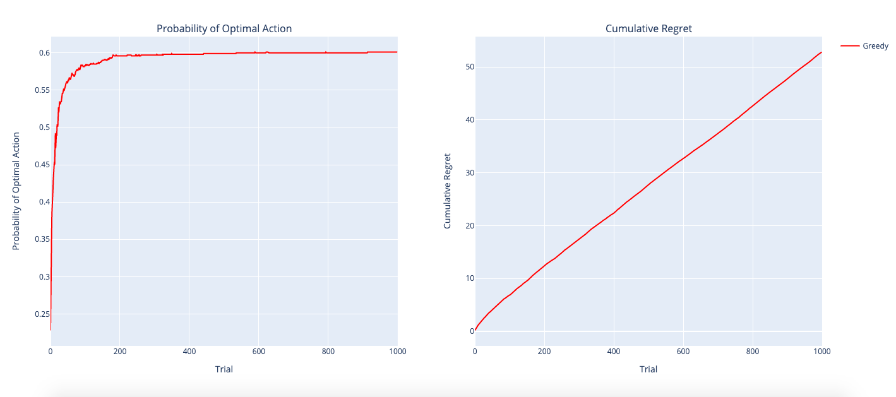

## Problem 2: Epsilon-Greedy Agent

**Expectations:** We expect the Epsilon-Greedy agent to be, in general, more successful than the Greedy agent because, unlike the Greedy agent, it does not _always_ choose what it thinks is the optimal choice, which might not be the true optimal choice if the agent unluckily chooses suboptimally earlier in the trial. At every choice, there is some probability (defined by epsilon) that the agent will explore/choose randomly instead of choosing what it believes to be optimal, so that in case it has the wrong idea of the optimal choice, there are chances for it to re-evaluate other options. We expect that greater values of epsilon will improve the agent's performance, but only to a point, because if epsilon is too small, the agent would not tend to explore enough to have accurate information about all the available actions and may frequently choose suboptimally; but if epsilon is too large, the agent will waste time exploring rather than exploiting, thus resulting in higher cumulative regret. As a result, **we expect the agent with e = 0.10 to perform the best. The agent with e = 0.05 would explore too little, thus achieving a relatively low probability of optimal action, and the agent with e = 0.15 would explore too much, thus failing to exploit enough even once it knows the optimal action; thus, both of these would have higher cumulative regret while also not reaching as high a probability of optimal action. With e = 0.1, we expect the middle agent to be a happy medium.**  

Note: All three should perform better than the Greedy agent, which means that graphically, the curves would level off at a higher y-value (probability of optimal action) than in the Greedy agent's graph, and the cumulative regret would increase quickly first and then more and more slowly. The curves for all three Epsilon-Greedy agents also should be noisier than the Greedy agent's since they might randomly explore at any given moment.
 

**Sim Results:**  
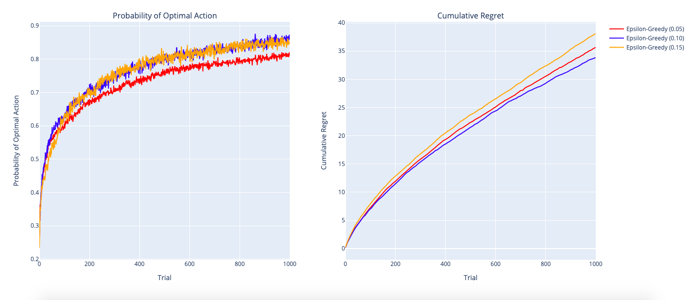

## Problem 3: Epsilon-First Agent

**Expectations:** To pick values of epsilon to test for the Epsilon-First agent, we had to consider the finite-time horizon T and the tradeoff between exploring and exploiting. The longer we allow the Epsilon-First agent to explore (the higher the epsilon value) the more time it takes to determine what the optimal choice is from all the actions, but **because there is a limited number of trials T=1000, the duration of the exploration stage (n = e \* T trials) is critical, and different values of epsilon can make or break the agent's success**: if we let the agent explore too much, then it does not have enough time to exploit its findings. Exploration is very costly in terms of increasing regret, so the longer we explore, the higher the cumulative regret. With too small an epsilon, we won't have much exploration time, which means that we won't have a very big initial jump in cumulative regret, but since it will not reach a very high OPT, its cumulative regret will slowly but steadily increase forever after. Thus, too small an epsilon means we run the risk of not performing as optimally because we do not have enough trials to have accurate initial information. On the other extreme, with a very large epsilon, we do a lot of exploring and can achieve a very accurate OPT, but the cost is huge; regret increases very steeply during exploration, so we would expect epsilon = 0.9 to have the highest cumulative regret. Thus, **we chose epsilon values between 0.1 and 0.9 to see how exploring for 100 trials (10% of the known time horizon) up to 900 trials (90% of the time horizon) would affect the agent's performance.**
If we didn't know T or if T was infinite, then we might be okay with using a lot of trials to explore; however, since we know T=1000, we think that e = 0.1 will be best because it leaves ample time to exploit, minimizing cumulative regret.
 

**Sim Results:**  
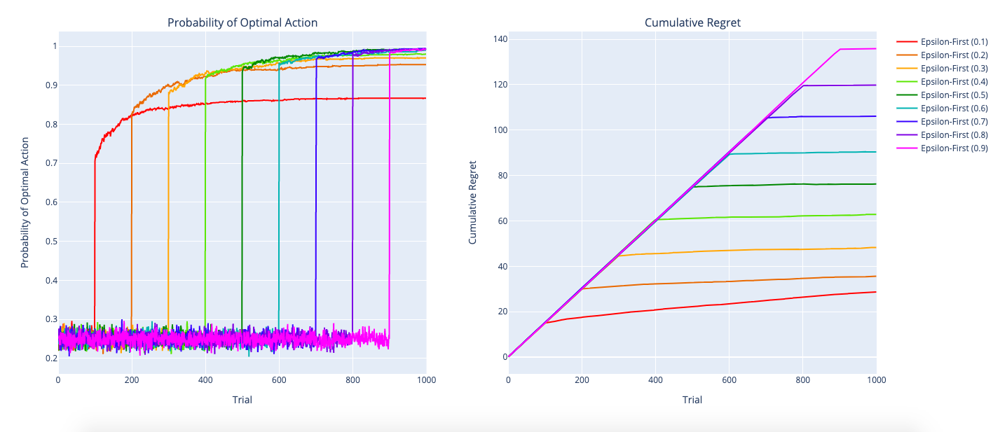

## Problem 4: Epsilon-Decreasing Agent

**Expectations:** To implement the Epsilon-Decreasing agent with simulated annealing, we developed **3 different cooling schedules: linear, exponential, and logarithmic.** Each of these cooling schedules gradually decreases the temperature, which in this problem's context is the probability that the agent will explore/choose randomly at a given trial. We wanted to explore different shapes of cooling schedule functions to see how factors like the rate of cooling and the final temperature after 1000 trials would affect the agent. The three functions we implemented are graphed below; we formulated the equations so that the curves would each be distinctly different, but not _too_ drastically. (For example, we didn't want the exponential cooling schedule to decrease the temperature so quickly that there would be virtually no time for the agent to explore, but meanwhile allow an agent with the linear cooling schedule to explore for a while, because then the difference the agents' performance would simply be because the former had no time to explore and would behave like the Greedy agent; instead, **we wanted all three functions to allow the agent some amount of ample time to explore, while experimenting with the _shape_ of the cooling schedule curve.**) The linear cooling schedule decreases epsilon by some small delta after every choice. The exponential cooling schedule scales epsilon by a factor of (1-delta) after every choice. The logarithmic function follows the function temperature = -epsilon \* log(currentTrials/totalTrials). We expected the linear cooling schedule to perform the worst, and this did turn out to be the case in the sim results shown below. The exponential schedule outperformed all of the rest of the cooling schedules, which was surprising because the temperature still had not reached 0 after 1000 trials. The logarithmic schedule performed a little bit worse than the exponential schedule.  
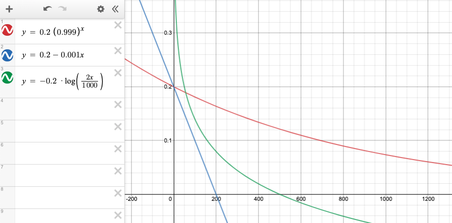

 

**Sim Results:**  
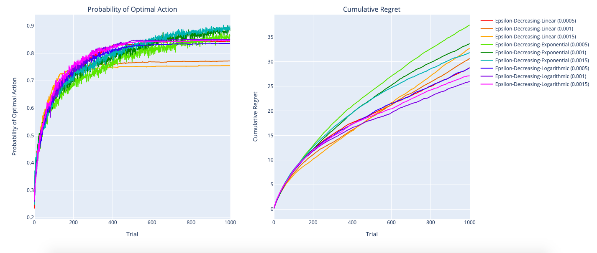

## Problem 5: Thompson Sampling Agent

#### Fun with numpy.random.beta!

(results can be found [here](../src/beta_simulation_results.txt))
 

**Problem 1:** For an infrequently sampled arm, the average of the Beta samples is **somewhat close to the true probability** of reward, 0.4 (~0.37) with a **relatively high variance** (~0.008) compared to the following iterations.
 

**Problem 2:** For more and more frequently sampled arms (for Beta(40,60) and then for Beta(400,600)), the average gets **closer and closer to the true value of 0.4** and the **variance gets smaller and smaller**, to almost negligible levels.

#### Thompson Sampling Agent

**Expectations:** We implemented the Thompson Sampling agent by **generating a Beta sample for each of the four ad choices** using that ad's recorded wins and losses in the agent's history. We then **chose the ad/action that produced the maximum Beta sample** (i.e. it had the highest probability of reward when we threw all four darts at their respective Beta curves); this allows the agent to be very likely to choose optimally over time because the most optimal action will frequently return higher Beta samples (with less variance) than the rest.
 

**Sim Results:**  
Thompson Sampling Alone:  
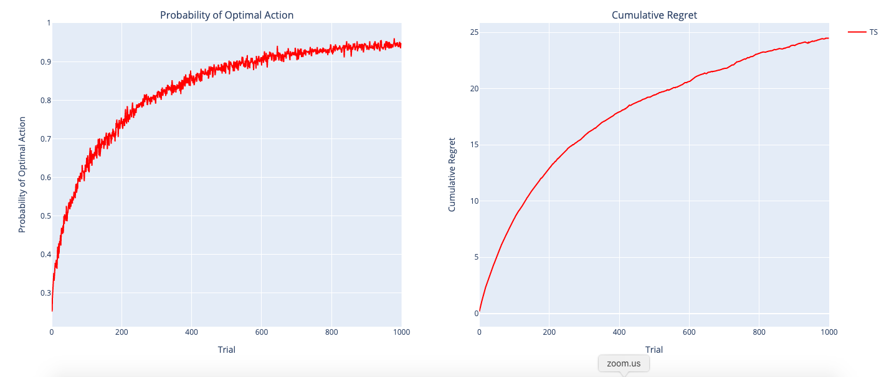
 
The Thompson Sampling agent ended up choosing optimally about 95% of the time.
 

Best of All Agents:  
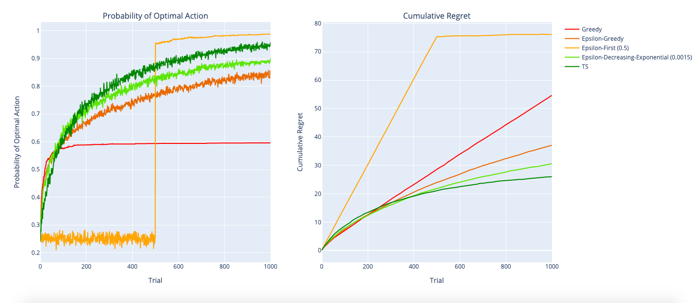
 
**The Thomson Sampling agent ended up being the most optimal overall**; although it came in second (behind the Epsilon-First agent) in terms of the probability of optimal action, it accrued the least amount of cumulative regret of all the agents, whereas the Epsilon-First agent had the most cumulative regret. Thus, ultimately, the Thompson Sampling agent is the best at managing explore v. exploit, minimizing regret while achieving relatively high accuracy.
 

**Compare:**  
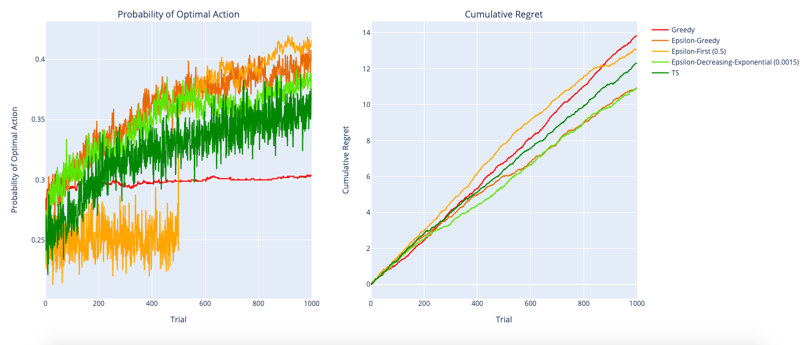
 
Overall, **all the agents did very poorly**; all of them had steadily increasing cumulative regret curves, and they only achieved OPT values of roughly 0.3-0.5. In particular, while Thompson Sampling had the best performance with the regular rewards, it is now somewhere in the middle of the pack; its cumulative reward is mediocre, and it is second-worst in terms of probability of optimal action.  
 

**Reflect:**

When comparing the five agents' overall performance, in general, the **Thompson Sampling agent does the best** by minimizing its cumulative regret while approaching a probability of optimal action = 1.0. **The Greedy agent consistently had poor performance** because it has no way to explore. Even though it will eventually avoid choices that clearly have a higher lose-rate than win-rate, if it unluckily is rewarded by a suboptimal choice early in the simulation, it will continue to choose suboptimally even after many trials; thus, it will never approach a probability of optimal reward of 1.0 and its cumulative regret inreases steeply forever. The **Epsilon-Greedy agent does generally better than the Greedy agent** because there is some probability at every trial that it will choose to explore rather than exploit, which means that it is less likely to get stuck with forever choosing a suboptimal choice since it will eventually gain information about all the available choices. However, the **Epsilon-First agent does even better because it deliberately does all its exploration in the beginning**, accruing regret very rapidly at first; but once it has explored, it has information about all the available actions and is likely to choose optimally ever after. The Epsilon-First agent's disadvantage is the fact that there must be a tradeoff between exploring too little and not having accurate information to exploit, or exploring too much and not having enough time to exploit; for larger and larger values of epsilon, the Epsilon-First agent is more likely to be accurate by the end of 1000 trials, but the cost is huge -- regret increases so much during exploration that it often ends up with the worst cumulative regret of all the agents. **The Epsilon-Decreasing agent performs second-best**; it results in almost as high accuracy as Thompson Sampling and has the second-least cumulative regret, because it combines the best of Epsilon-First and Epsilon-Greedy -- it is more likely to explore in the beginning and becomes more likely to exploit as time goes on. However, ultimately, **Thompson Sampling is still the best at managing explore v. exploit; by using Beta samples, it self-corrects so that it will not accidentally explore too much like Epsilon-first, and the optimal choice eventually reveals itself after many iterations.**  

With the one simulation that we ran with very similar rewards, Thompson Sampling was no longer the best, and in fact, **all the agents did very poorly**. This is because all the agents have **difficulty distinguishing which option to exploit even after many trials because the differences in their true probability of reward are so minimal.** A single decision (and resulting win or loss) would be enough to tip the scales in favor of a different choice, making it difficult to properly epxloit. In this sim run, Epsilon-greedy ended up performing the best because it had the second highest probability of optimal action and the lowest cumulative regret. Its best performance in this case could be due to the fact that there is little to gain from exploring since all the probabilities of reward are so similar, so Epsilon-greedy performs better because it explores a little bit but does not waste too many trials exploring.  

If we were to have an **_infinite_ or very large time horizon (and adequately distinguishable P(Reward) for each action), the Thomson Sampler would prove better than the rest** because it would have the time to explore and exploit properly. To further look into how an infinite time horizon T would affect the different agents' performances, we ran the simulation with the original P_R = [0.5, 0.6, 0.4, 0.3] but increased T to 4000 trials. The resulting graphs are shown below; the Thompson Sampling agent did end up being the most successful, with an OPT of nearly 1.0 and minimal cumulative regret that leveled off to an almost negligible slope over time.  

If we did not know the time horizon at all, howver, it's **possible that the time horizon might be very short. In this case, Thompson Sampling may not be the best choice** since it requires time to explore before becoming more inclined to exploit. If we examine the cumulative regret graph for all the best agents, the Greedy and Epsilon-Greedy agents actually have less regret for t<200 trials. But in general, unless the time horizon is very short, Thompson Sampling usually comes out on top.  

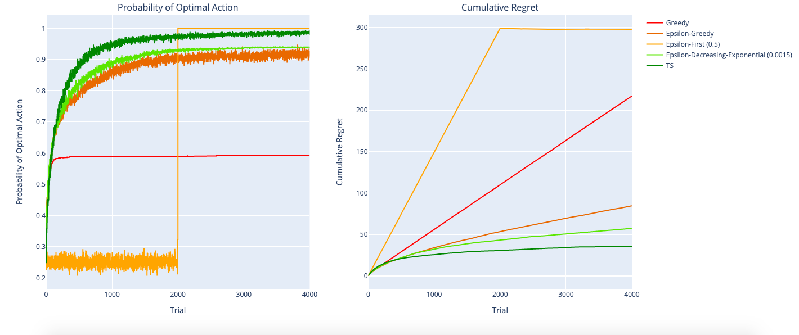

## Problem 6: The Contextual Bandit Player

### 6.1

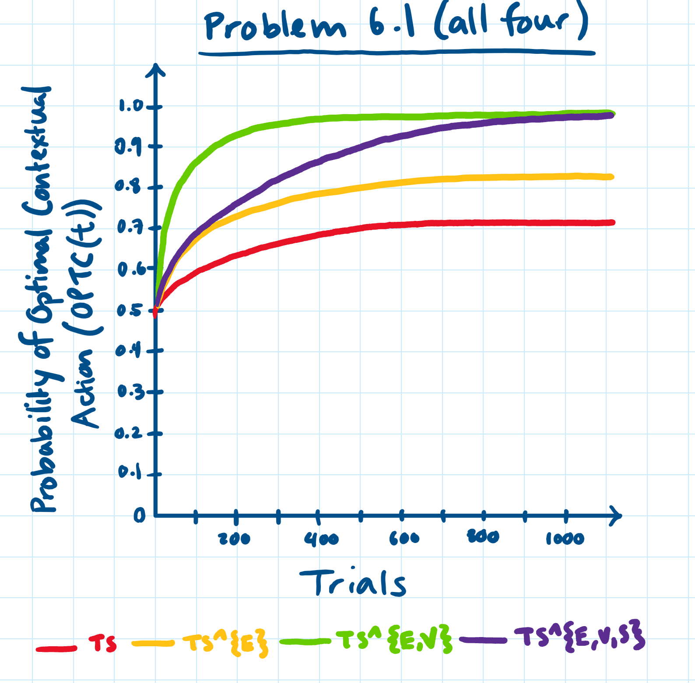
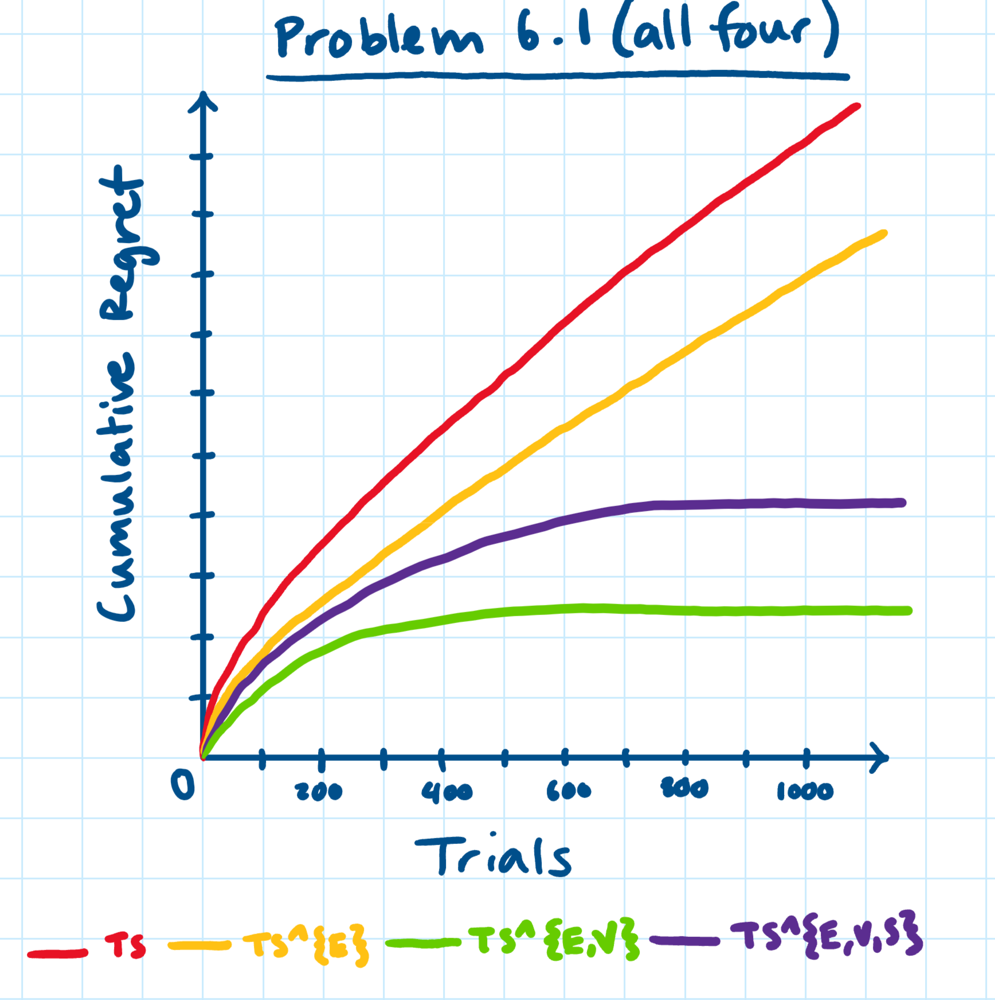
 

**A few notes on the above two graphs:**  

Since K=2 for this problem, the **y-intercept of each curve would be roughly 0.5** (because all agents begin with a 50% chance of selecting the true optimal choice). **TS (red curve), the non-contextual agent, would have an OPTC curve that does not approach anywhere near 1.0** on the y-axis because it is completely blind to the contextual factors that affect the reward; while it would improve over time, it would be the least accurate of the four agents.  

**TS^{E} (yellow curve) would have an OPTC curve that is a little higher than TS**, but still would not approach 1.0 because unlike TS, it does account for at least part of the context, but it still is missing information; without conditioning on V, this agent does not have the full picture.  

**TS^{E,V} (green curve) would perform the best** of all four agents, because it accounts for the maximal contextual set Z*. The Reward is dependent on both E and V, and it is independent of S given E and V, so Z* = {E,V}. This means that the agent will eventually approach an OPTC(t) value of 1.0 -- since it has a complete picture of information, it will eventually consistently make the optimal contextual choice.  

TS^{E,V,S} (purple curve) would also approach an OPTC value of 1.0 because its set Z does account for the two contextual variables that matter, E and V; however, conditioning on S as well is unnecessary (because R is independent of S given E and V), and actually puts the agent at a disadvantage since it has fewer data points to learn from. This means that **it will take longer for its curve to approach 1.0 (but it will still get there**, assuming T=1000 trials is an adequately large time horizon for it to learn).  

As such, the Cumulative Regret graph shows that **TS will have the worst cumulative regret**; it will increase rapidly at first, and then less rapidly, but will still have a steep positive slope for the rest of the trials since it never approaches OPTC(t) = 1.0. Similarly, **TS^{E} would also increase rapidly and then slow down, but continue steadily increasing** (less steeply than TS) for the rest of the trials. However, **TS^{E,V} would increase rapidly at first, but then quickly level off** as it approaches OPTC(t) = 1.0, resulting in the lowest cumulative regret. Similarly, **TS^{E,V,S}'s cumulative regret would also level off eventually**, but would take longer to do so, resulting in the second-best cumulative regret.

### 6.2

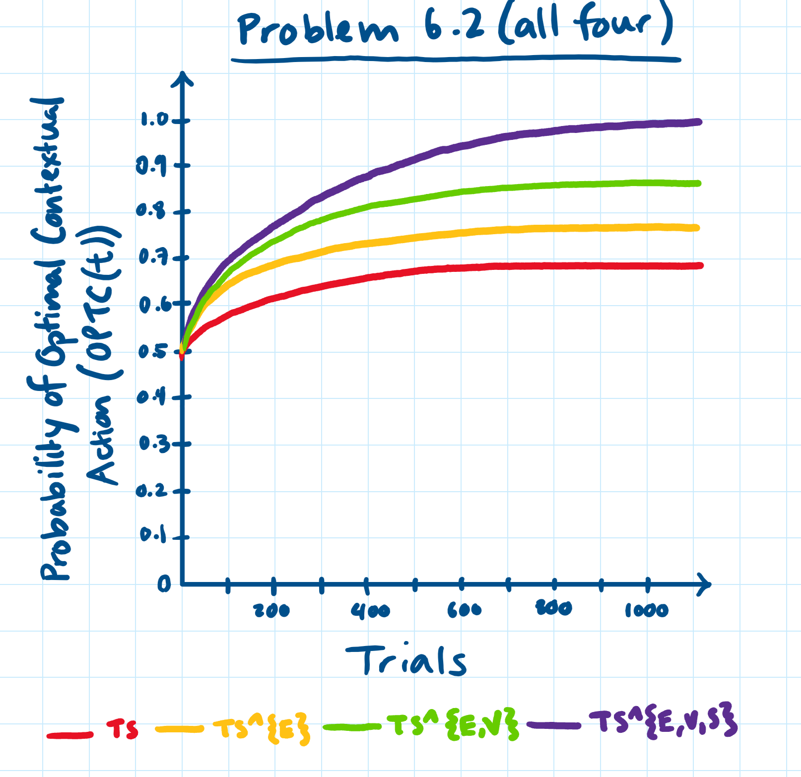
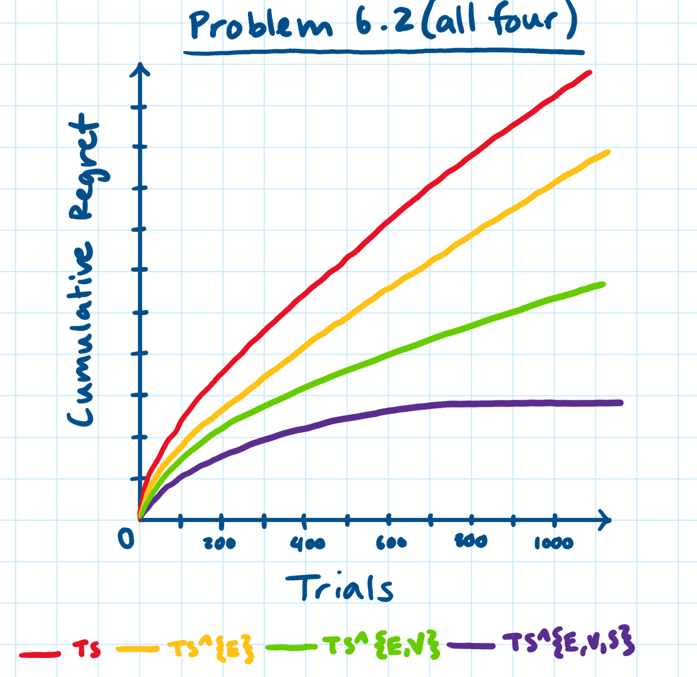
 

Since there is now an unobserved confounder between S and R, **S is no longer independent of R given E and V**, so the maximal contextual set Z\* = {E,S,V} rather than just {E,V} (S still gives us information about R through the unobserved confounder even after conditioning on E and V). As a result, TS^{E, S, V} would be the most optimal agent. **It would be the only OPTC curve that would approach a probability of optimal contextual action = 1.0** because it is now the only agent that accounts for all aspects of the context that give us information about the reward. **TS^{E,V} would now be suboptimal** and would not approach 1.0; instead, like TS^{E} and TS, it would get stuck at a lower value of OPTC(t). Thus, the Cumulative Regret graph would show that TS^{E,V,S}'s cumulative regret still levels off after a while, but that TS^{E,V} continues to increase steadily, as do TS^{E} and TS (which still has the worst overall performance).
